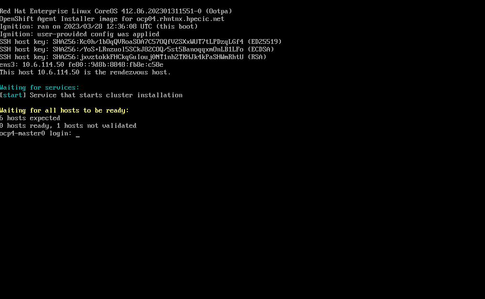
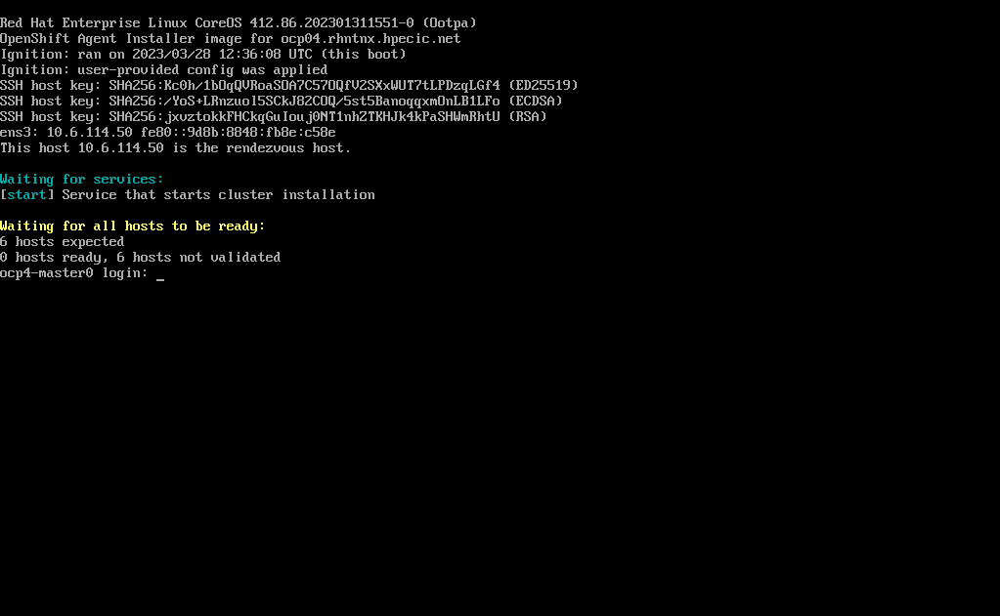
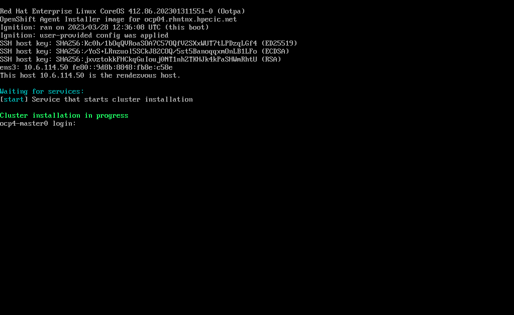

# How to install an OpenShift cluster with openshift installer agent based method

## Description

**New installation method from OCP 4.12**

The Agent-based installation method provides the flexibility to boot your on-premises servers in any way that you choose. It combines the ease of use of the Assisted Installation service with the ability to run offline, including in air-gapped environments. Agent-based installation is a subcommand of the OpenShift Container Platform installer. It generates a bootable ISO image containing all of the information required to deploy an OpenShift Container Platform cluster, with an available release image.

## Prerequisites 

  * RHEL bastion host wirh openshift-install 4.12 binary
  * Facolity to mount ISO image on your hosts

## Installation steps


### 1. Download openshift installer binary
```
https://console.redhat.com/openshift/downloads
```

### 2. Install nmstatectl on your bastion host
```
sudo dnf install /usr/bin/nmstatectl -y
```

### 3. Create a dedicated directory and needed configuration files
```
mkdir agent-based
```

**install-config.yaml :** Define OCP cluster
```
vim agent-based/install-config.yaml
apiVersion: v1
baseDomain: rhntnx.hpecic.net
compute:
- architecture: amd64
  hyperthreading: Enabled
  name: worker
  replicas: 3
controlPlane:
  architecture: amd64
  hyperthreading: Enabled
  name: master
  replicas: 3
metadata:
  name: ocp04 
networking:
  clusterNetwork:
  - cidr: 10.144.0.0/14
    hostPrefix: 23
  machineNetwork:
  - cidr: 10.6.114.0/23
  networkType: OVNKubernetes 
  serviceNetwork:
  - 172.34.0.0/16
platform:
  baremetal:
    apiVIPs:
    - 10.6.114.34
    ingressVIPs:
    - 10.6.114.35
pullSecret: '<pull_secret>' 
sshKey: '<ssh_pub_key>' 
```

**agent-config.yaml :** Define **rendezvousIP** to install cluster from ISO
```
vim agent-based/agent-config.yaml
apiVersion: v1alpha1
kind: AgentConfig
metadata:
  name: ocp04
rendezvousIP: 10.6.115.200
```

### 4. Generate ISO image from installer
```
openshift-install --dir agent-based/ agent create image
WARNING Capabilities: %!!(MISSING)s(*types.Capabilities=<nil>) is ignored 
INFO The rendezvous host IP (node0 IP) is 10.6.115.200 
INFO Extracting base ISO from release payload     
INFO Verifying cached file                        
INFO Using cached Base ISO /root/.cache/agent/image_cache/coreos-x86_64.iso 
INFO Consuming Install Config from target directory 
INFO Consuming Agent Config from target directory 
```

### 5. Boot machine using generated ISO image

  * Create one machine with **rendezvousIP**. This machine will be responsible to insall other machines
  * Other machines can stay on DHCP mode
  * Modifiy boot order with  
        1. Disk  
        2. CDROM  

**rendezvous host**


**other host waiting rendezvous host**


**All hosts OK after few time**


**OCP install in progress**



### 6. Check boot process
```
openshift-install --dir agent-based/ agent wait-for bootstrap-complete --log-level=info 
```