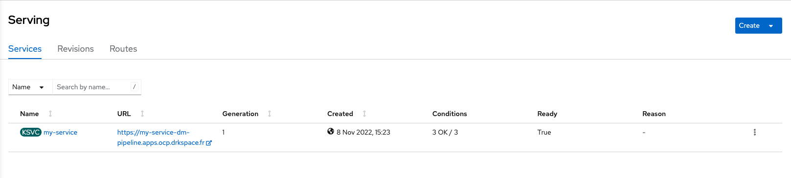
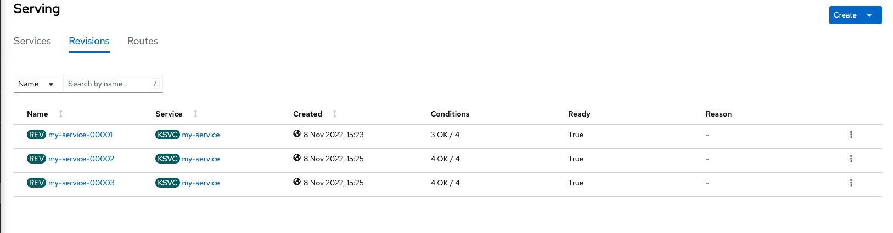
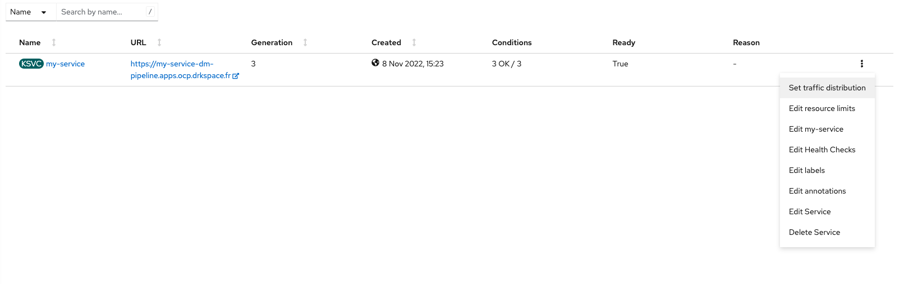
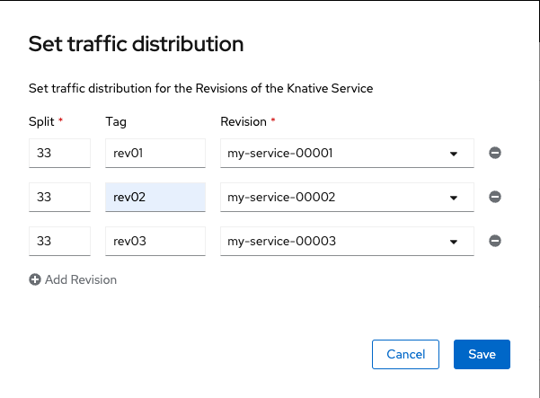
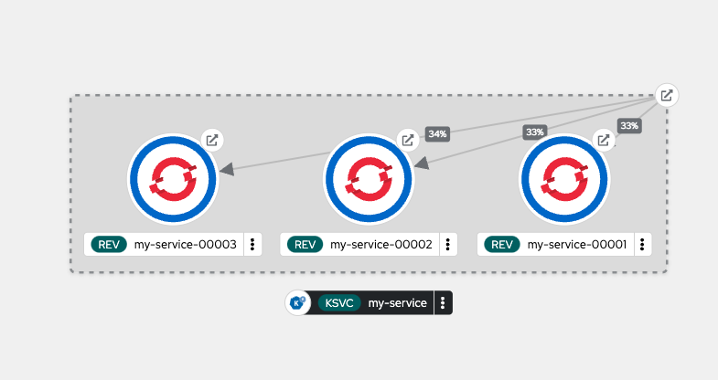
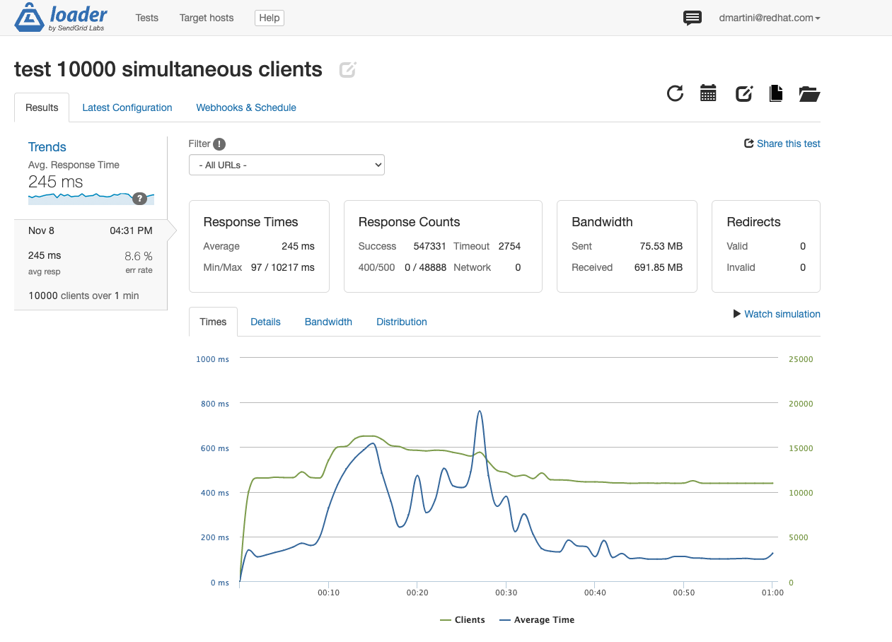
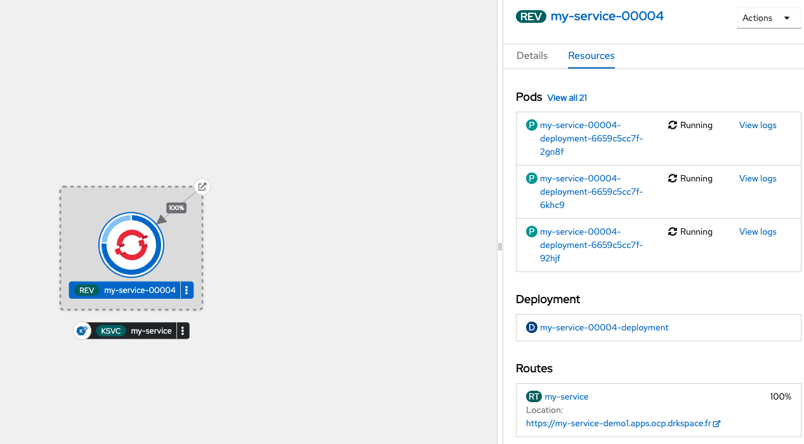

# Demo for OpenShift Serverless

## 1. Sample demo with multiple revisions

1. Create a new project (ex : serverless-demo)  

2. Create new service in Serverless Serving
```
apiVersion: serving.knative.dev/v1
kind: Service
metadata:
  name: serverless-demo
  labels:
    app.kubernetes.io/part-of: my-serverless-application
spec:
  template:
    spec:
      containers:
        - image: quay.io/david_martini/serverless:rev01
```  

  

3. Create new revisions with rev02 & rev03 image tags  

  

4. Set traffic distribution  


  

5. Display Serverless Topology  



6. Change min & max pod for a revision  

```
bash-4.4 ~ $ kn service update my-service --scale-min 5 --scale-max 100
```

7. Benchmark your serverless website (https://loader.io/)




## 2. Create Quarkus + BDD PostgreSQL

1. Create new service in Serverless Serving
```
apiVersion: serving.knative.dev/v1
kind: Service
metadata:
  name: my-service
  namespace: serverless-demo
spec:
  template:
    spec:
      containers:
        - image: quay.io/david_martini/openshift:crud
``` 

2. Stress web application
```
ali --rate=0 -w 30 -c 20000 -d 5m --insecure https://sample-demo.apps.ocp01.demo.ntnx.fr/
```

## 3. Deploy an application to Knative using kn

1. Create a new space
```
oc new-project kn-demo
```

2. Deploy the application. We will create a Knative Service named fib-knative which will run our fib-knative image on dockerhub.
```
kn service create fib-knative --image docker.io/ibmcom/fib-knative
Creating service 'fib-knative' in namespace 'kn-demo':

  0.030s The Route is still working to reflect the latest desired specification.
  0.048s ...
  0.071s Configuration "fib-knative" is waiting for a Revision to become ready.
 20.399s ...
 20.433s Ingress has not yet been reconciled.
 20.474s Waiting for load balancer to be ready
 20.664s Ready to serve.

Service 'fib-knative' created to latest revision 'fib-knative-00001' is available at URL:
https://fib-knative-kn-demo.apps.ocp.drkspace.fr
```

3. Have a description of Knative service
```
kn service describe fib-knative
Name:       fib-knative
Namespace:  kn-demo
Age:        11m
URL:        https://fib-knative-kn-demo.apps.ocp.drkspace.fr

Revisions:  
  100%  @latest (fib-knative-00001) [1] (11m)
        Image:     docker.io/ibmcom/fib-knative (pinned to 9eac25)
        Replicas:  0/0

Conditions:  
  OK TYPE                   AGE REASON
  ++ Ready                  10m 
  ++ ConfigurationsReady    10m 
  ++ RoutesReady            10m 
```

4. Test and charge your application
```
export MY_APP_URL=https://fib-knative-kn-demo.apps.ocp.drkspace.fr
curl -k $MY_APP_URL/5
curl -k $MY_APP_URL/50
curl -k $MY_APP_URL/500
```

## Update KN application with new release and manage traffic


1. Update First Revision Name
```
kn service update fib-knative --revision-name fib-knative-one
```

2. Deploy second release
```
 kn service update fib-knative --image docker.io/ibmcom/fib-knative:vnext --revision-name fib-knative-zero
 kn service describe fib-knative
 Updating Service 'fib-knative' in namespace 'kn-demo':

  0.017s The Configuration is still working to reflect the latest desired specification.
 11.382s Traffic is not yet migrated to the latest revision.
 11.406s Ingress has not yet been reconciled.
 11.437s Waiting for load balancer to be ready
 11.606s Ready to serve.

Service 'fib-knative' updated to latest revision 'fib-knative-zero' is available at URL:
https://fib-knative-kn-demo.apps.ocp.drkspace.fr
[root@workstation ~]# kn service describe fib-knative
Name:       fib-knative
Namespace:  kn-demo
Age:        2d
URL:        https://fib-knative-kn-demo.apps.ocp.drkspace.fr

Revisions:  
  100%  @latest (fib-knative-zero) [7] (14s)
        Image:     docker.io/ibmcom/fib-knative:vnext (pinned to c13569)
        Replicas:  1/1

Conditions:  
  OK TYPE                   AGE REASON
  ++ Ready                   2s 
  ++ ConfigurationsReady     2s 
  ++ RoutesReady             2s 
kn revision list
NAME                SERVICE       TRAFFIC   TAGS   GENERATION   AGE     CONDITIONS   READY   REASON
fib-knative-zero    fib-knative   100%             7            59s     4 OK / 4     True    
fib-knative-one     fib-knative                    6            104s    3 OK / 4     True    
fib-knative-00005   fib-knative                    5            21m     3 OK / 4     True    
fib-knative-00004   fib-knative                    4            2d17h   3 OK / 4     True    
fib-knative-00003   fib-knative                    3            2d17h   3 OK / 4     True    
fib-knative-00002   fib-knative                    2            2d17h   3 OK / 4     True    
fib-knative-00001   fib-knative                    1            2d17h   3 OK / 4     True    
```

3. Manage traffic between 2 revisions
```
kn service update fib-knative --traffic fib-knative-zero=10 --traffic fib-knative-one=90
kn service describe fib-knative
Name:       fib-knative
Namespace:  kn-demo
Age:        2d
URL:        https://fib-knative-kn-demo.apps.ocp.drkspace.fr

Revisions:  
   10%  fib-knative-zero (current @latest) [7] (2m)
        Image:     docker.io/ibmcom/fib-knative:vnext (pinned to c13569)
        Replicas:  1/1
   90%  fib-knative-one [6] (3m)
        Image:     index.docker.io/ibmcom/fib-knative@sha256:9eac25880e2305a6d08e76440089823e3dd9cf861271147ebfc86b3faca06273 (at 9eac25)
        Replicas:  0/0

Conditions:  
  OK TYPE                   AGE REASON
  ++ Ready                   3s 
  ++ ConfigurationsReady     2m 
  ++ RoutesReady             3s 
```
