# Step 02 - Create Hosted cluster with Hypershift in ACM

## 1. Create VM manually with agent discovery image and boot on it

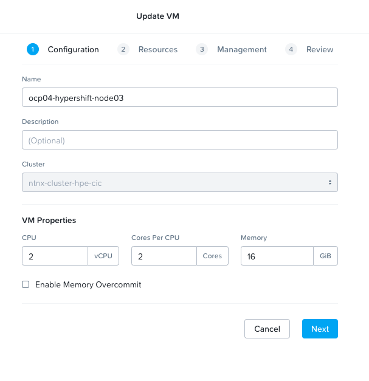  

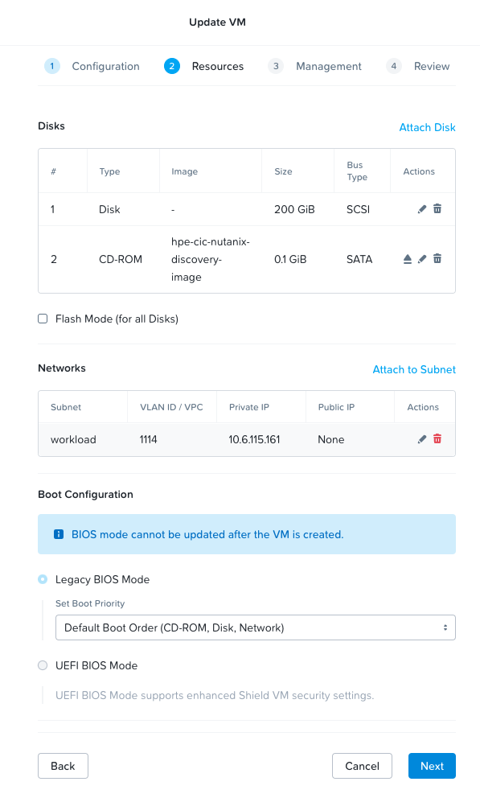 

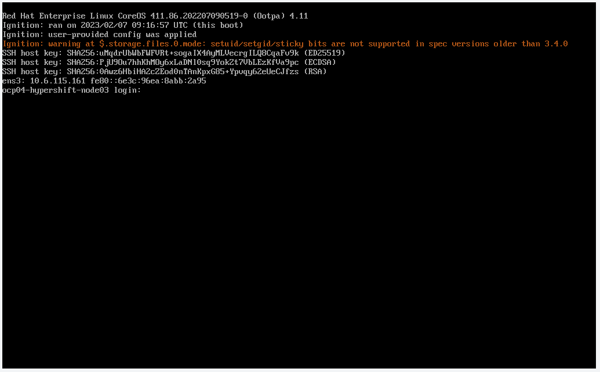 

## 2. Created VM are automatically integrated in ACM's hosts inventory via agent discovery image

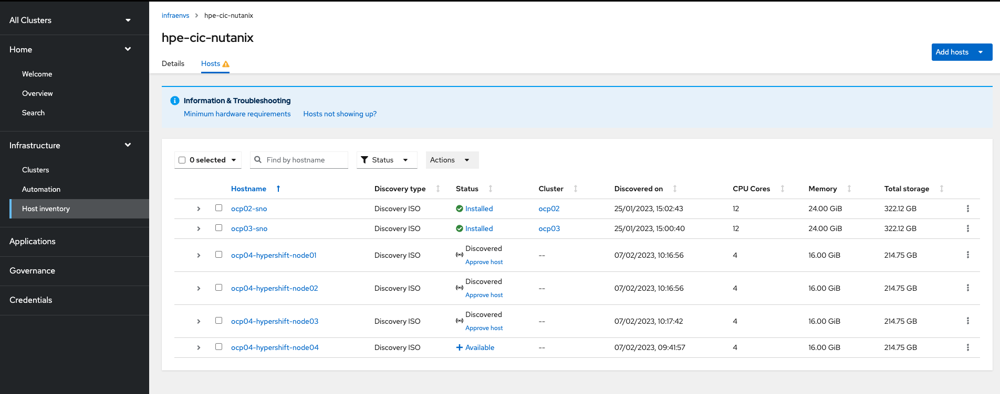

## 3. Aprove discovered host

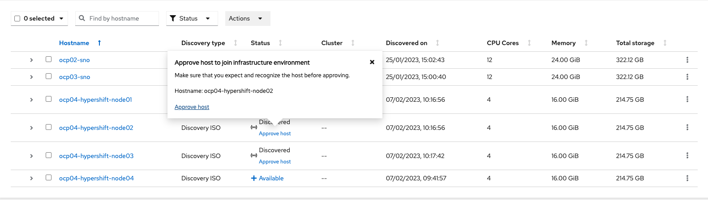

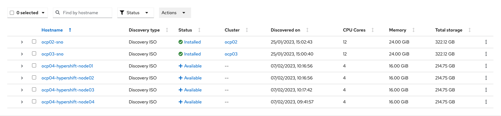

## 4. Update VMs to eject CDROM to boot on disk next reboot

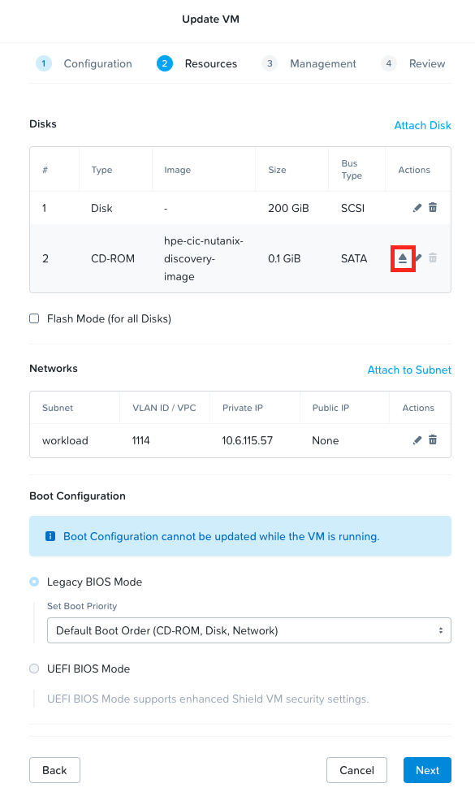

## 5. Create Hosted cluster via ACM WebUI

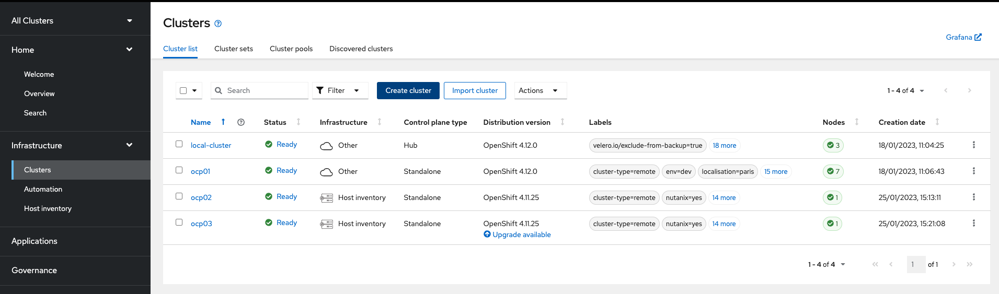

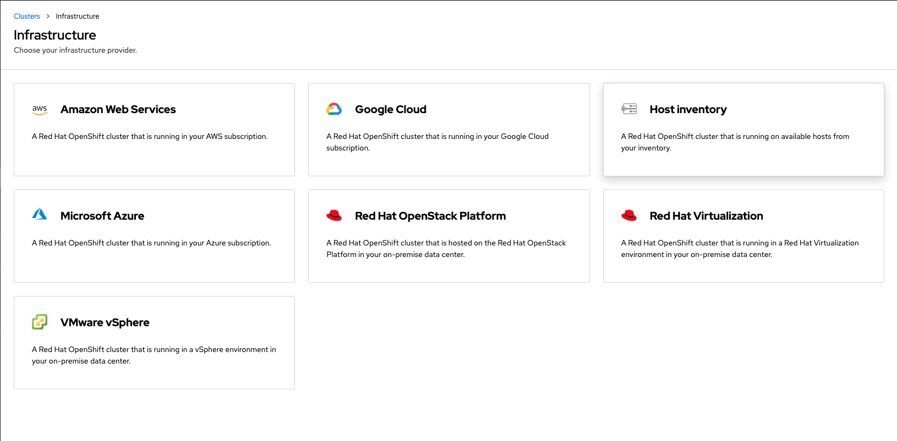

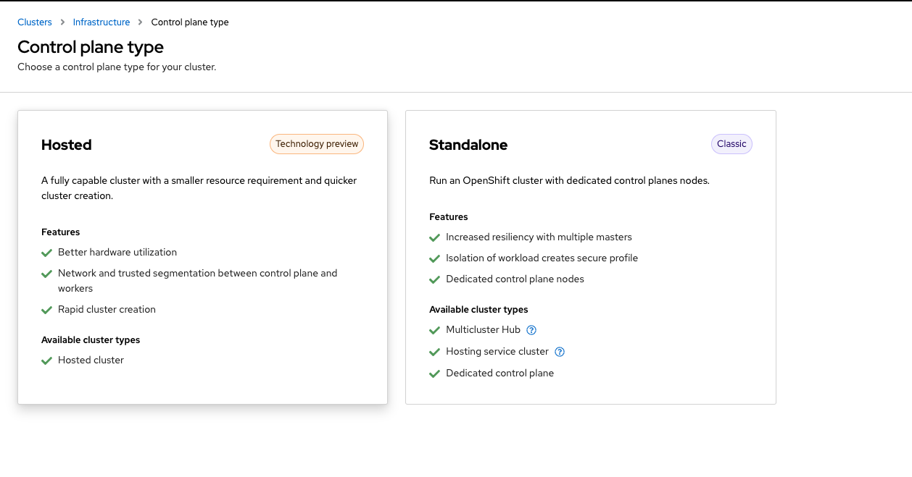

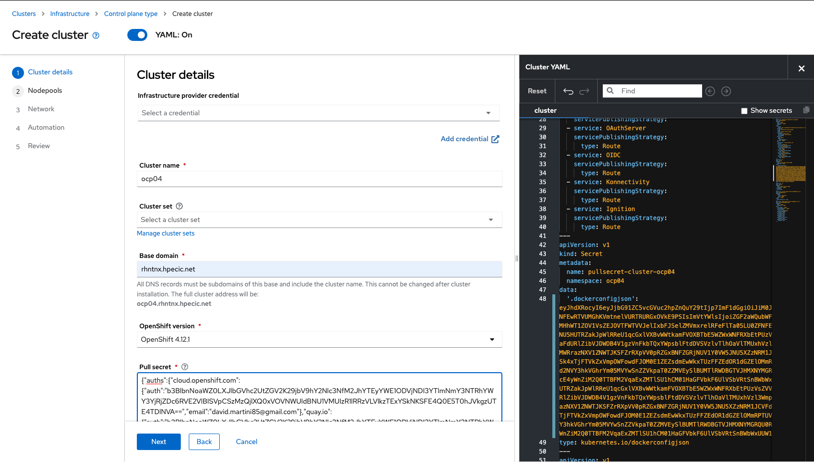

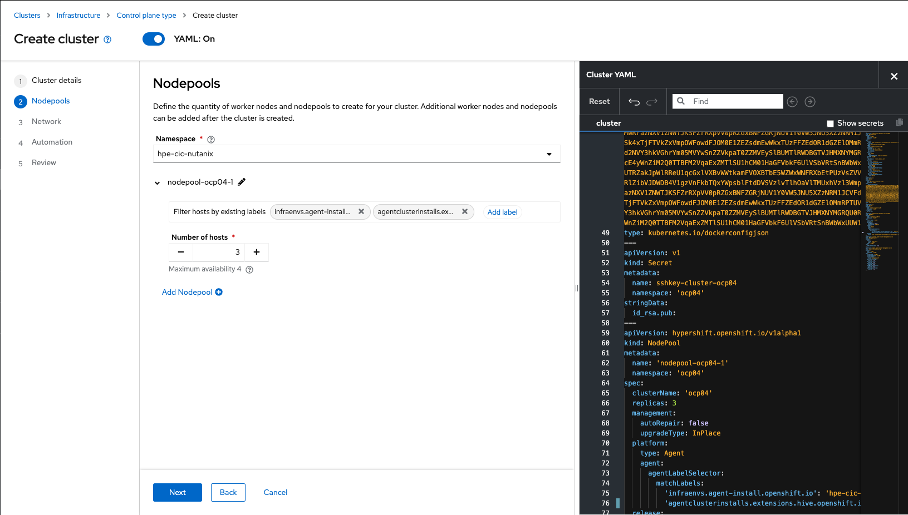

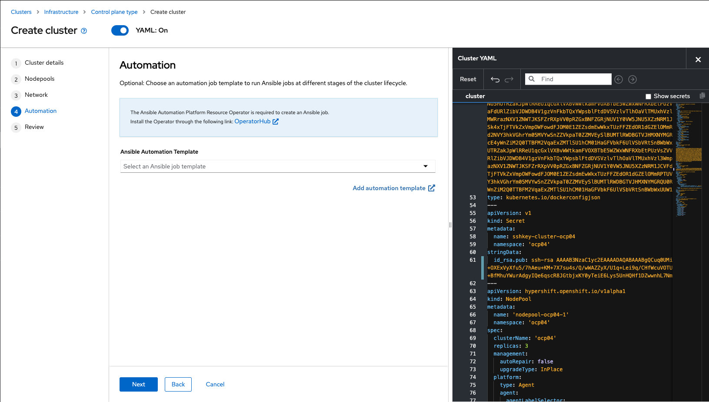

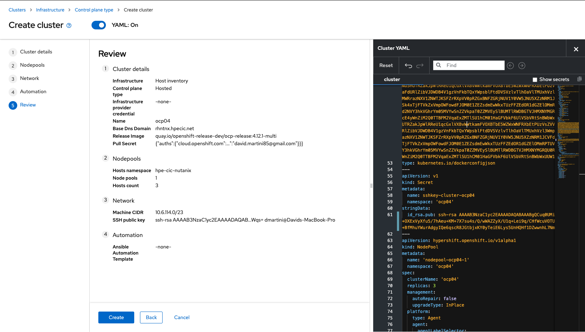

## 6. Check Hosted cluster deployment 

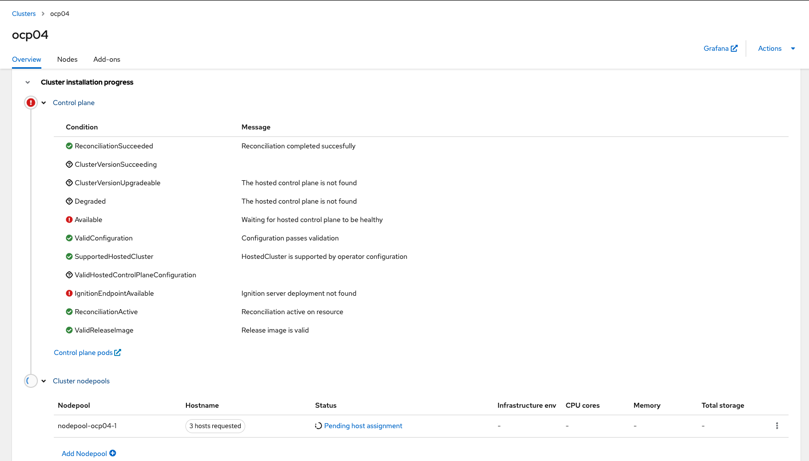

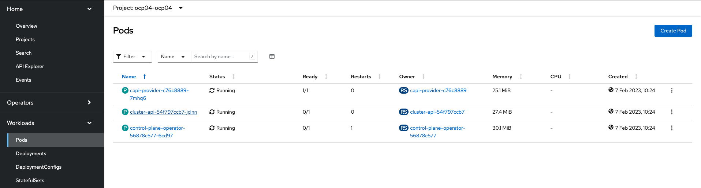

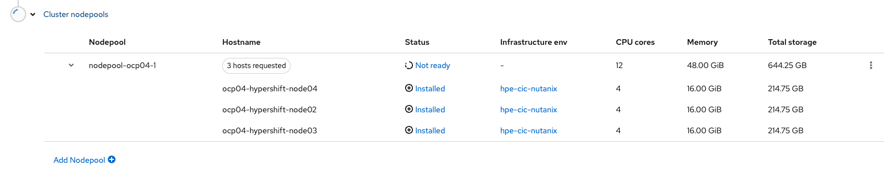

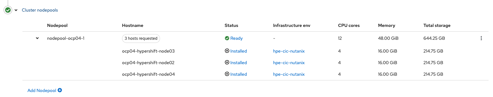

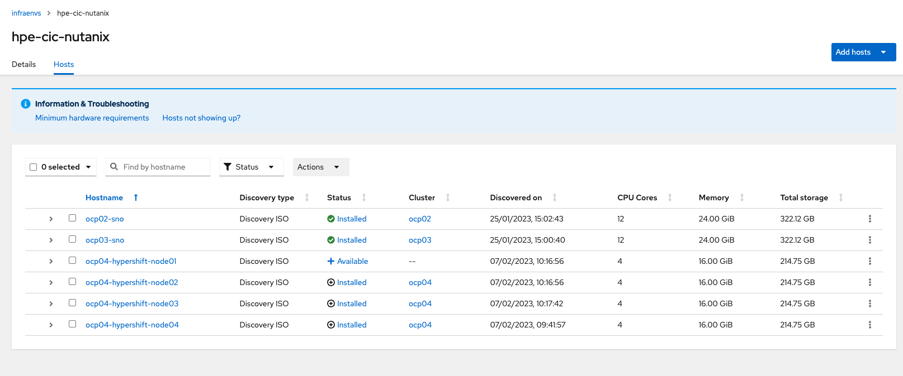

