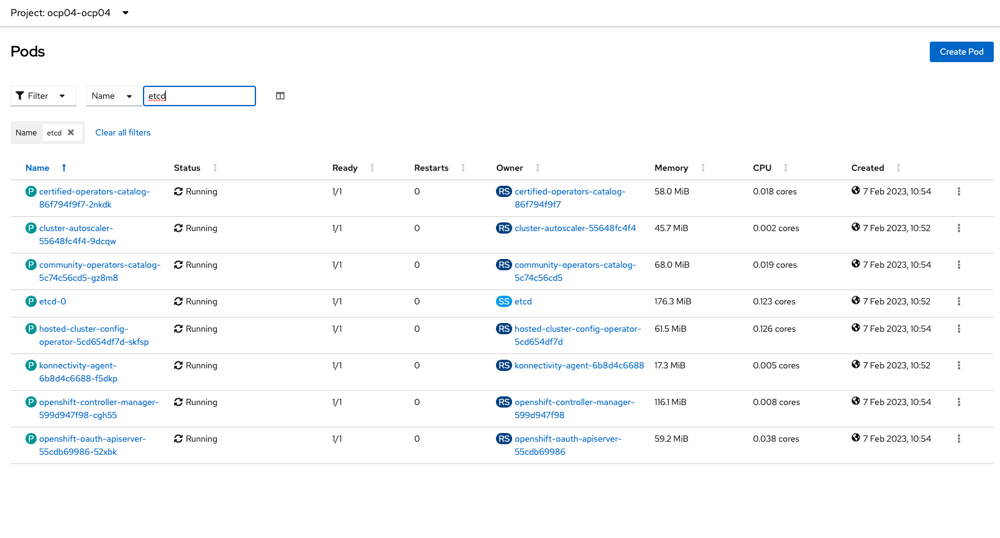
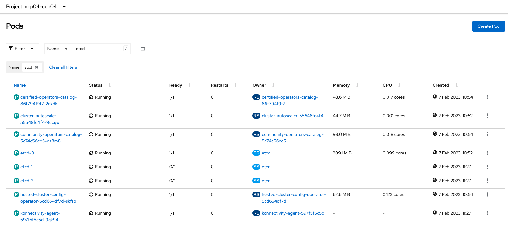

# Step 03 - Enable HA for deployed hosted cluster

When you deploy Hosted OpenShift cluster with ACM, control plane is deployed with no HA (1 pod for ETC and OVN for example)

To have High Availability on the control plane, we have to modify **HostedCluster** object to replace **SingleReplica** by **HighlyAvailable**

<pre>
apiVersion: hypershift.openshift.io/v1alpha1
kind: HostedCluster
metadata:
  name: ocp04
  namespace: ocp04
spec:
  fips: false
  release:
    image: 'quay.io/openshift-release-dev/ocp-release:4.11.25-x86_64'
  dns:
    baseDomain: rhntnx.hpecic.net
  controllerAvailabilityPolicy: <b>SingleReplica</b>
  infraID: ocp04
  etcd:
    managed:
      storage:
        persistentVolume:
          size: 4Gi
        type: PersistentVolume
    managementType: Managed
  infrastructureAvailabilityPolicy: <b>SingleReplica</b>
  platform:
    agent:
      agentNamespace: hpe-cic-nutanix
    type: Agent
    ...
</pre>

<pre>
apiVersion: hypershift.openshift.io/v1alpha1
kind: HostedCluster
metadata:
  name: ocp04
  namespace: ocp04
spec:
  fips: false
  release:
    image: 'quay.io/openshift-release-dev/ocp-release:4.11.25-x86_64'
  dns:
    baseDomain: rhntnx.hpecic.net
  controllerAvailabilityPolicy: <b>HighlyAvailable</b>
  infraID: ocp04
  etcd:
    managed:
      storage:
        persistentVolume:
          size: 4Gi
        type: PersistentVolume
    managementType: Managed
  infrastructureAvailabilityPolicy: <b>HighlyAvailable</b>
  platform:
    agent:
      agentNamespace: hpe-cic-nutanix
    type: Agent
    ...
</pre>

We have now 3 replicats of critical parts to provide High Availability on hosted control plane

