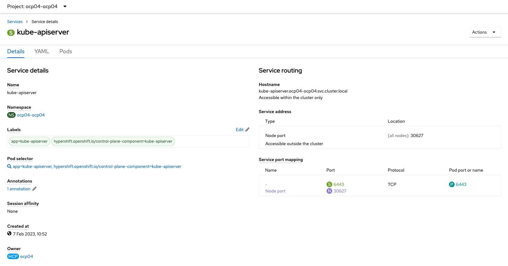

# Step 04 - Network part focus

**ocp04** Hosted cluster deployed via ACM have this network configuration

| What | Where hosted | accessible via |
| ---- | ------------ | --------------- |
| **ocp04** control plane | **ocp04-ocp04** namespace in ACM cluster where control plane pods are created | node port & routes on ACM cluster |
| **ocp04** data plane | on VMs created with agent and discovery image | routes |



### HA Proxy config

HA Proxy config for LB where Control plane API backend corresponding to **node port** created on ACM clusternodes. Ingress backend corresponding to VMs and who host ingress component. 

```
...
#---------------------------------------------------------------------
# main frontend which proxys to the backends
#---------------------------------------------------------------------

frontend api
    bind 10.6.112.10:6443
    default_backend controlplaneapi

frontend secure
    bind 10.6.112.10:443
    default_backend secure

frontend insecure
    bind 10.6.112.10:80
    default_backend insecure

#---------------------------------------------------------------------
# static backend
#---------------------------------------------------------------------

backend controlplaneapi
    balance source
    server master0 10.6.115.68:30627 check
    server master1 10.6.115.171:30627 check
    server master2 10.6.115.20:30627 check

backend secure
    balance source
    server worker0 10.6.115.145:443 check
    server worker1 10.6.115.161:443 check
    server worker2 10.6.115.57:443 check

backend insecure
    balance source
    server worker0 10.6.115.145:80 check
    server worker1 10.6.115.161:80 check
    server worker2 10.6.115.57:80 check
```