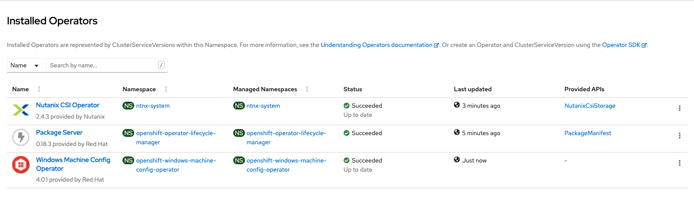
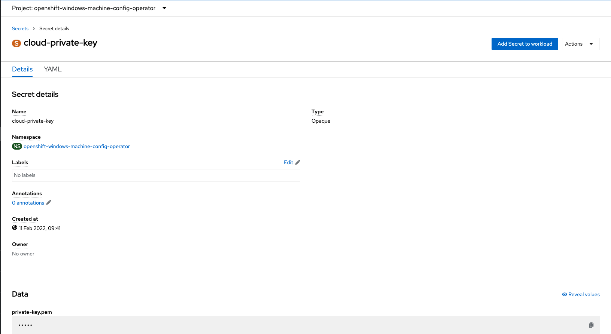
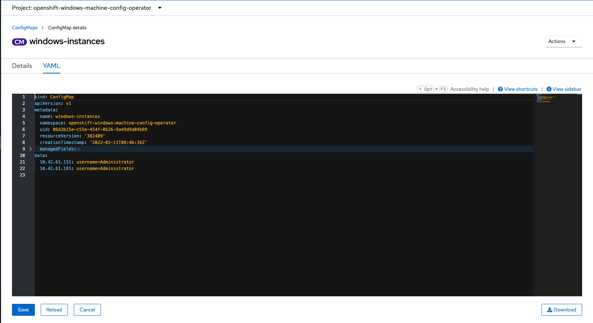
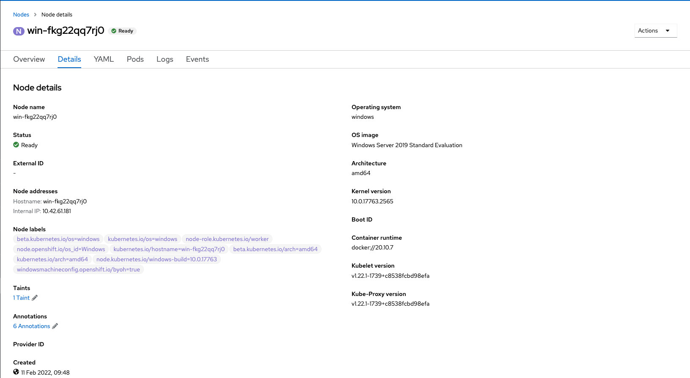
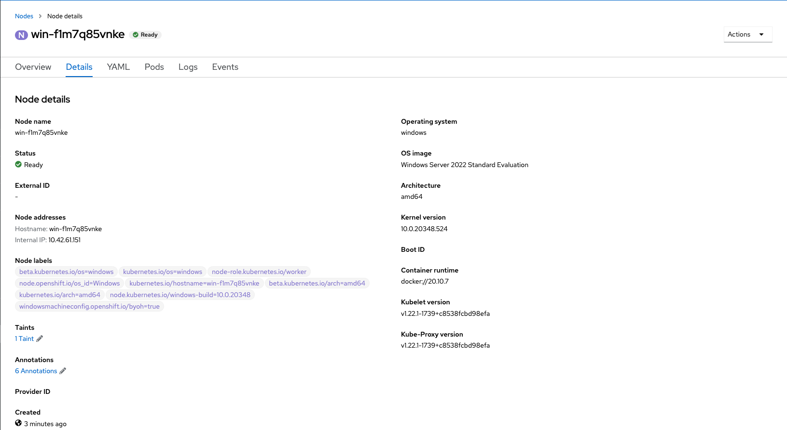
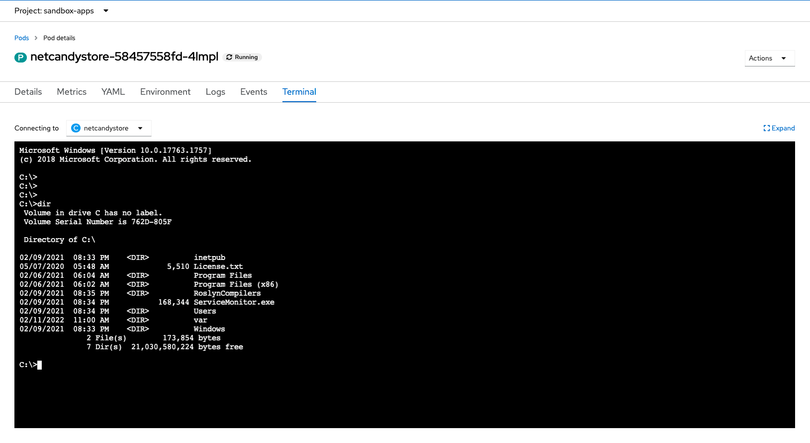

# Documentation to install a cluster with Linux & Windows worker nodes

## Context

In this documentation, I will present to you how to deploy a mix cluster with Linux and Windows node to host modern applications and legacy applications based on old dotnet framework.

## Reminder

> :warning: If your applications are based on .NET core, **you don't need Windows nodes !**. You can run your application on natif Linux worker nodes with certified, supported, secure container images provided by Red Hat.

> :warning: If your applications are based on the **legacy** .NET Framework, you need to have Windows nodes to run these specific Windows containers. In this case, Windows nodes will be dedicated to run these containers. 

## Lab environment

- A OpenShift cluster version 4.9
- Cluster deployed on virtual environment (Nutanix stack)
- 3 master nodes
- 3 Linux CoreOS worker nodes
- 1 Windows 2019 worker node
- 1 Windows 2022 worker node 

## Important prerequisites 

- A OCP4 cluster with OVN as network SDN
- SDN Hybrid configuration in place before cluster deployment 

## Deployment

### 1. Install a cluster with OVN-Kubernetes as SDN with hybrid configuration  
> :memo: https://docs.openshift.com/container-platform/4.9/networking/ovn_kubernetes_network_provider/configuring-hybrid-networking.html  

### 2. Deploy dedicated Windows operator via OperatorHub marketplace

> :memo: https://docs.openshift.com/container-platform/4.9/windows_containers/enabling-windows-container-workloads.html

> :warning: Click the Enable Operator recommended cluster monitoring on the Namespace checkbox to enable cluster monitoring for the WMCO.





### 3. Deploy your Windows nodes

Being on a platform not supporting MachineSet (AWS, Azure or vSphere), I deployed manually Windows VMs with fresh install to add them in a second time following documented Bring-Your-Own-Host (BYOH) process.  

After Windows VM deployed, you have just to install Docker engine and OpenSSH server on your nodes (documentend bellow) before to integrate the node to your OCP cluster.  

Please verify your deployment match with described prerequisites : https://docs.openshift.com/container-platform/4.9/windows_containers/byoh-windows-instance.html


### 4. Install Docker on your Windwos nodes  
> :memo: https://computingforgeeks.com/how-to-run-docker-containers-on-windows-server-2019/

In a Powershell window :
````
# Add repository
Install-Module -Name DockerMsftProvider -Repository PSGallery -Force
````

````
# Install docker
Install-Package -Name docker -ProviderName DockerMsftProvider
````

````
# Reboot server
Restart-Computer -Force
````

````
# Get Installed version
Get-Package -Name Docker -ProviderName DockerMsftProvider
 Name                           Version          Source                           ProviderName
 ----                           -------          ------                           ------------
 docker                         18.09.2          DockerDefault                    DockerMsftProvider
````

````
# Start service
Start-Service Docker
````


### 5. Instal OpenSSH on your Windows nodes  
> :memo: https://docs.microsoft.com/en-us/windows-server/administration/openssh/openssh_install_firstuse

In a Powershell window :
````
# Check package
Get-WindowsCapability -Online | Where-Object Name -like 'OpenSSH*'
Name  : OpenSSH.Client~~~~0.0.1.0
State : NotPresent

Name  : OpenSSH.Server~~~~0.0.1.0
State : NotPresent
````

````
# Install the OpenSSH Server
Add-WindowsCapability -Online -Name OpenSSH.Server~~~~0.0.1.0
````

````
# Start the sshd service
Start-Service sshd

# OPTIONAL but recommended:
Set-Service -Name sshd -StartupType 'Automatic'

# Confirm the Firewall rule is configured. It should be created automatically by setup. Run the following to verify
if (!(Get-NetFirewallRule -Name "OpenSSH-Server-In-TCP" -ErrorAction SilentlyContinue | Select-Object Name, Enabled)) {
    Write-Output "Firewall Rule 'OpenSSH-Server-In-TCP' does not exist, creating it..."
    New-NetFirewallRule -Name 'OpenSSH-Server-In-TCP' -DisplayName 'OpenSSH Server (sshd)' -Enabled True -Direction Inbound -Protocol TCP -Action Allow -LocalPort 22
} else {
    Write-Output "Firewall rule 'OpenSSH-Server-In-TCP' has been created and exists."
}
````


### 6. Configure Pub key on your Windows nodes  
> :memo: https://docs.microsoft.com/en-us/windows-server/administration/openssh/openssh_keymanagement

For admin users:
````
# Use scp to copy the public key file generated previously on your client to the authorized_keys file on your server
scp $YOUR_PUB_KEY administrator@$IP:C:\ProgramData\ssh\administrators_authorized_keys

# Appropriately ACL the authorized_keys file on your server
ssh administrator@$IP icacls.exe "C:\ProgramData\ssh\administrators_authorized_keys" /inheritance:r /grant "Administrators:F" /grant "SYSTEM:F"
````


### 7. Create Private Key as secret in the openshift-windows-machine-config-operator OCP namespace
````
oc create secret generic cloud-private-key --from-file=private-key.pem=$YOUR_PRIVATE_KEY -n openshift-windows-machine-config-operator 
````




### 8. Create ConfigMap

This ConfigMap order to windows-machine operator to add specified node(s) in your cluster.
````
kind: ConfigMap
apiVersion: v1
metadata:
  name: windows-instances
  namespace: openshift-windows-machine-config-operator
data:
  10.1.42.1: |- 
    username=Administrator 
  instance.example.com: |-
    username=core
````

:warning: During this node integration process, you will meed to accept CSR.
````
# Get pending CSR
oc get csr
# Approve CSR
oc adm certificate approve $CSR_ID
````




### 9. Enjoy result 

- Windows 2019 VM as worker node in a OCP cluster


- Windows 2022 VM as worker node in a OCP cluster


- Metrics on Windows node


- Terminal on a running Windows container on a Windows node



## Applications examples

### .NET Core : Modern framework

[S2I .NET Core](https://github.com/redhat-developer/s2i-dotnetcore-ex)

### .NET Framework : Legacy framework

[.NET Framework app](https://github.com/redhat-developer-demos/netcandystore)
